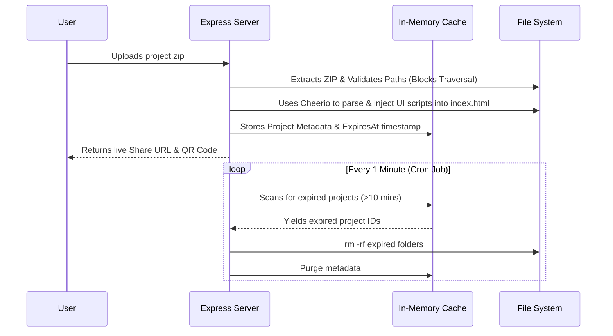

<div align="center">
  
  <h1>RunZip ⚡</h1>
  <p><strong>Ephemeral drag-and-drop hosting for static web projects.</strong></p>

  [](https://runzip.onrender.com)
  [](https://vitest.dev/)
  [](LICENSE)
</div>

<br />

RunZip is a highly secure, ephemeral hosting platform built with Node.js and Express. It allows students and developers to instantly share HTML/CSS/JS projects without creating accounts or dealing with complex deployment pipelines. 

Upload a `.zip` file, and get a live, shareable URL and QR code instantly. **Projects self-destruct after 10 minutes.**

## 🚀 Live Demo
**Try it now:** [https://runzip.onrender.com](https://runzip.onrender.com)

---

## ✨ Key Features

* **⚡ Zero-Friction Hosting:** Drag and drop a ZIP file. Get a live URL in under 3 seconds.
* **⏱️ Ephemeral Architecture:** Projects live for exactly 10 minutes. A built-in cron job wipes the disk automatically to ensure storage limits are never exceeded on free-tier cloud hosts.
* **🛡️ Hardened Security:** Actively blocks malicious Path Traversal (`../../`) upload attacks and includes strict IP Rate Limiting.
* **🏎️ In-Memory Caching:** Database reads are cached in memory, preventing slow disk I/O bottlenecks.
* **📱 Instant Sharing:** Auto-generates shareable QR codes and "Share Landing Pages" for mobile testing.
* **📊 Analytics Ready:** Pre-configured with Google Analytics tracking.

---

## 🏗️ Architecture & Workflow

RunZip utilizes a monolithic Express backend with an ephemeral local file system, supported by an in-memory metadata cache.



---

## 💻 Local Development

RunZip is fully configured for easy local development and testing.

### Prerequisites
* Node.js (v18 or higher)
* Git

### Installation

1. Clone the repository:
   ```bash
   git clone https://github.com/rvkarthik579/runzip.git
   cd runzip
   ```

2. Install dependencies:
   ```bash
   npm install
   ```

3. Run the development server:
   ```bash
   npm run dev
   ```
   *The server will start at `http://localhost:4000`*

### Running Tests
The project features a comprehensive Vitest testing suite covering the HTML injection logic and path sanitization.
```bash
npm run test
```

---

## ☁️ Deployment

RunZip is natively configured to deploy to **Render.com** via the included `render.yaml` blueprint.

1. Create an account on [Render](https://render.com/).
2. Click **New +** -> **Blueprint**.
3. Connect this GitHub repository.
4. Render will automatically install dependencies, bind to `0.0.0.0`, and deploy the application.

---

## 🛠️ Tech Stack

* **Backend:** Node.js, Express.js
* **HTML Parsing/Injection:** Cheerio
* **File Handling:** Multer, Unzipper
* **Testing:** Vitest
* **Frontend:** Vanilla JavaScript, CSS Variables (Custom Design System)

---

## 📄 License
This project is licensed under the MIT License. See the [LICENSE](LICENSE) file for details.
